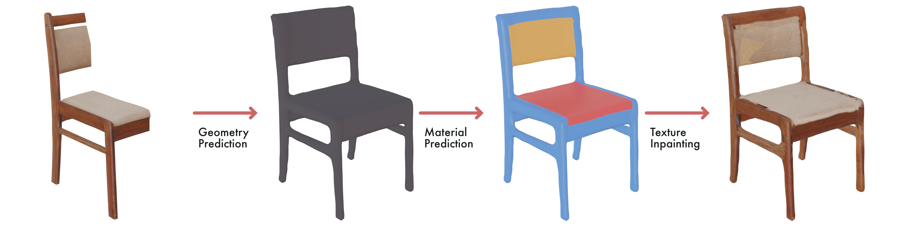

# Generation Tools
The main goal of this research is to accurately complete occluded parts of existing 3D models in 3D scans and separate them from the environment to make them interactive.

## Part 1: Geometry, Material and Texture Completion of Partially Scanned 3D Objects

### What?
Completing 3D models of partial 3D scanned objects, both using existing geometry completion networks and introducing a new texture completion step.

### How?
The object is completed in 2 steps, first using AutoSDF to generate the completed geometry. Second segmenting the Object texture into distinct material groups using SAM. Third using a modified IF-Net to predict the material index of the newly generated geometry. Last, using Patch-based inpainting to create the final texture, using the material index as masks.

- [AutoSDF](https://github.com/JelleKUL/AutoSDF)
    > VAE to encode SDF's (2022)
- [Segment Anything Model](https://github.com/facebookresearch/segment-anything)
    > Object mask generator (2023)
- [Implicit Feature Networks for Texture Completion from Partial 3D Data](https://github.com/JelleKUL/if-net_texture)
    > IF-NET completing partial scans of humans, both geometry and texture (2020)
- [Patch-based Inpainting](https://github.com/Analyzable-FR/patch-based-texture-inpainting)
    > Image inpainting using Patch-based examples (2018)
  
#### Datasets
- [3DObjTex.v1](https://cvi2.uni.lu/sharp2022/challenge1/)
- [Matterport3d](https://niessner.github.io/Matterport/)
- [ShapeNet](https://shapenet.org/)
- [ScanNet](http://www.scan-net.org/)
- [PartNet](https://partnet.cs.stanford.edu/)
- [Real World Textured Things (RWTT)](https://texturedmesh.isti.cnr.it/)

## Part 2:  Generative Scene Completion

### What?
Converting a scanned environment into a collection of environment and object models that are filled in from all sides and occlusions

### How?
Combine the object completion with the segmentation model and room cleanup model to create a full room with moveable furniture

[3D Semantic Scene Completion: A Survey](https://doi.org/10.1007/s11263-021-01504-5)

#### Datasets
- [Replica-Dataset](https://github.com/facebookresearch/Replica-Dataset)
- [Matterport3d](https://niessner.github.io/Matterport/)
- [ScanNet](http://www.scan-net.org/)
- [3D-front](https://tianchi.aliyun.com/specials/promotion/alibaba-3d-scene-dataset)
- [Hypersim](https://github.com/apple/ml-hypersim)
- [scanNet++](https://cy94.github.io/scannetpp)
