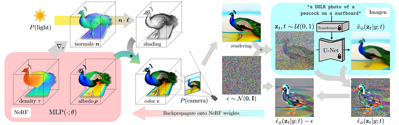

# 3D generative model generation

Using 2d diffusion to generate multiple viewpoints of a 3D object and using Nerfs to render the full 3D object

## Concepts

### Fixed sized representation of 3d models

Due to the structure of deep learning models, the input size of the data is rigid. This is not a problem for Images, since they can be easily resized.

#### Voxel Grids

The space is divided in a regular voxel grid, where each point is represented by an occupied voxel.

#### INR

Neural implicit representations
create a neural network to represent every position in the data (pixel coordinate of sound timestamp) to the correct value

### Nerfs

[Neural Radiance Fields](./Neural-Radiance-Fields.md)

3d representations based on rgb images from an arbitrary viewpoint. See NERFS for more info.

### Texture Fields

https://github.com/autonomousvision/texture_fields

Maps a 3D location to a color value

While these can easily produce consistent 3D meshes, they are not very detailed and look more like pointcloud colors stretched over the mesh

### Latent space encoding

reducing the object representation size by reducing the amount of dimensions needed to define it.

this reduced representation also makes it easier to interpolate between different objects

Generally created with an auto encoder.

## Workings

Each model has slight variations but in general they work the same:

- Using an Image generator the create a single view representation based on a text prompt
- we train a nerf on the first image and using normal estimation, light it correctly.
- we slightly shift the nerf camera and add noise to the result.
- we generate a new image based on the noisy new perspective image and retrain the nerf with a new extra image.
- we repeat until satisfied.

## Existing Models

### Dreamfusion

[DreamFusion: Text-to-3D using 2D Diffusion](http://arxiv.org/abs/2209.14988)

### Stable Dreamfusion

https://github.com/ashawkey/stable-dreamfusion

Uses stable diffusion and zero 1 to 3 to reconstruct 3d models

### Magic 3D

https://research.nvidia.com/labs/dir/magic3d/

### Shape-E

https://github.com/openai/shap-e
