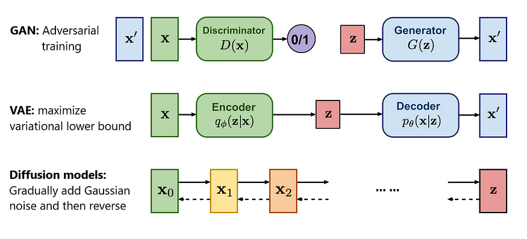

# Generative Models

Recent breakthroughs in text-to-image synthesis have been driven by diffusion models trained on billions of image-text pairs. Adapting this approach to 3D synthesis would require large-scale datasets of labeled 3D assets and efficient architectures for denoising 3D data, neither of which currently exist.

This page explains the different types on machine learning networks that are used to generate Images.

## GAN

[Generative Adversarial Networks]

2 networks are trained simultaniously where the first model $G$ is trained to genererate a result and the second model $D$ is trained to discriminate between the real and fake data. While these generate great results, they can be very hard to train.

- 2 networks: Generator, discriminator
- trained with: Adversarial loss

## VAE

Variational Autoencoder: [Reducing the Dimensionality of Data with Neural Networks]

Autoencoder is a neural network designed to learn an identity function in an unsupervised way to reconstruct the original input while compressing the data in the process so as to discover a more efficient and compressed representation. It consists of an Encoder network, which converts the data to a lower dimentional *latent space* and a Decoder network, which converts the *latent space* back into the original dimensions.

- VAEs store latent attributes as probability distributions
- 2 networks: encoder, decoder
- trained with: minimising L2 loss
  - The loss of the autoencoder is to minimize both the reconstruction loss (how similar the autoencoder’s output to its input) and its latent loss (how close its hidden nodes were to a normal distribution).

## Flow-based 

Flow-based Generative Models

a stack of invertable transormations is applied. a flow model f is constructed as an invertible transformation that maps the high-dimensional random variable x to a standard Gaussian latent variable z=f(x), as in nonlinear independent component analysis

## Transformers

mimic the human brain with neural pathways

## [Diffusion](./Image-Diffusion.md)

Diffusion based network

- 1 networks: reverse diffuser
- trained with: minimising L2 loss

## Sources

[Generative Adversarial Networks]: https://doi.org/10.48550/arXiv.1406.2661

[Reducing the Dimensionality of Data with Neural Networks]: https://doi.org/10.1126/science.1127647